# Souq Connect — MENA Retail/Distribution ERP

**One thesis:** in a cash-on-delivery (COD) market, cash does not arrive
when the invoice is validated — it arrives days later, carried by a
driver. Standard Odoo's "post revenue and receivable together at invoice
time" assumption is wrong here. Souq Connect makes the real, delayed
cash flow a first-class accounting fact: every state transition that
moves (or fails to move) money produces a **balanced double-entry
journal entry** — never a cosmetic status flag with no ledger effect.

A single Odoo 18 addon, **`souq`** (this directory), built from a
5-module SRS down to one cohesive install, covering:

- Branch-scoped COD accounting (`sale.order`, `account.move`)
- Driver cash custody and settlement (`souq.cod.collection`,
  `souq.driver.settlement`, `souq.driver.float`)
- Delivery/driver assignment and a return-on-delivery flow
- A configurable COD surcharge, applied/removed as an order line
- Multi-branch stock visibility and inter-branch transfers with a
  visible in-transit state
- ZATCA-style QR e-invoicing with a bilingual (AR/EN) RTL report

**What it demonstrates:** real double-entry accounting logic on top of
Odoo's ORM (not cosmetic fields), an enforced state machine with
illegal-transition guards, role-based access control with per-driver
record rules, ZATCA-style TLV/QR e-invoicing, Arabic/RTL localization,
a Docker-packaged deployment, a `TransactionCase` test suite covering
every acceptance scenario, and a Playwright script that walks and
screenshots the live app end to end.

**Contents:** [See it running](#see-it-running) ·
[Install](#install) · [Order-to-ledger flow](#the-order-to-ledger-flow) ·
[COD state machine](#cod-state-machine) · [Security](#security) ·
[E-invoicing](#e-invoicing-zatca-style-qr) · [Tests](#tests) ·
[Screenshots](#screenshots)

## See it running

**Branch configuration** — warehouse, cash/clearing/cash-diff accounts, settlement journal.
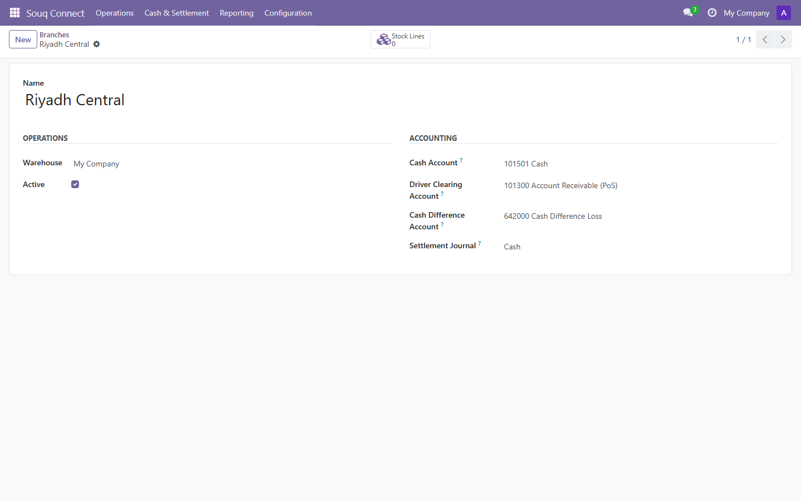

**Settings** — the optional COD surcharge, fixed or percentage.
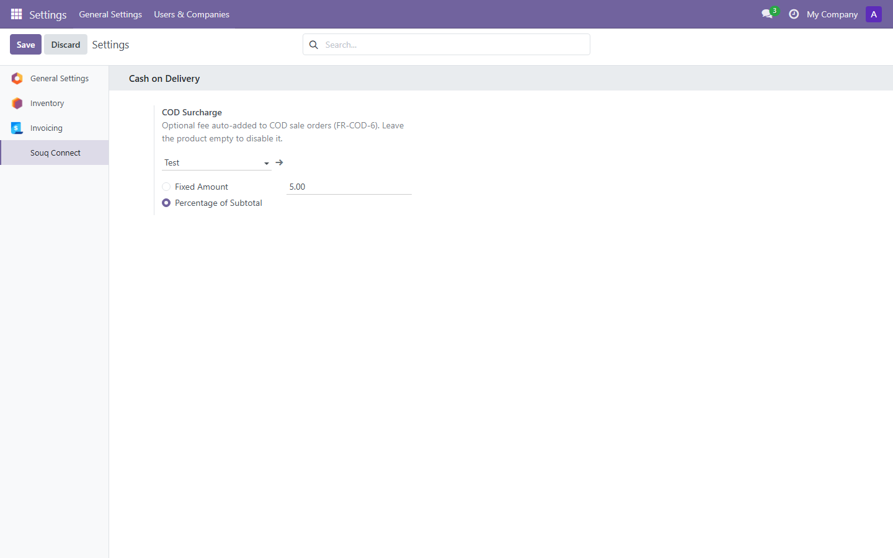

**Quotations** — COD orders alongside standard ones.
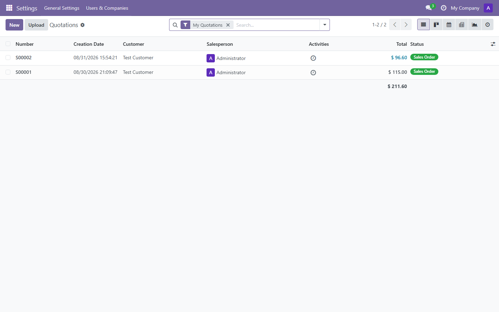

**COD sale order** — Payment Mode, Branch, and the Pending → Collected → Settled statusbar.
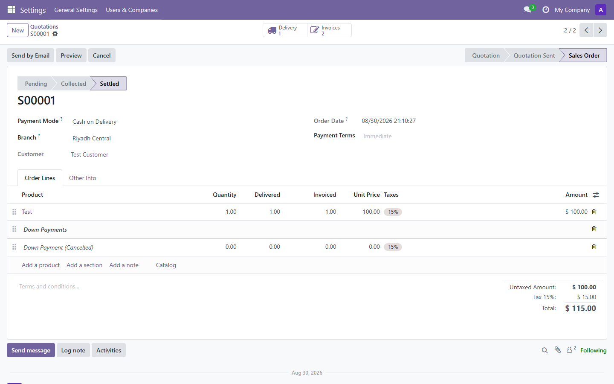

**Delivery** — Branch/Driver fields and the Refuse Delivery / Return button.
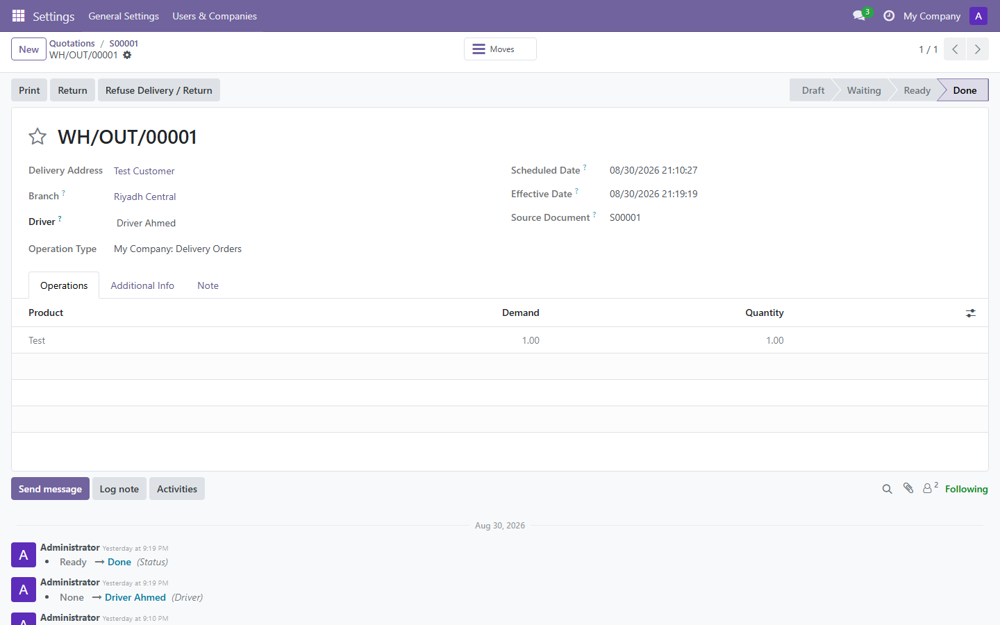

**Invoice** — the Souq COD branch group above the invoice lines.
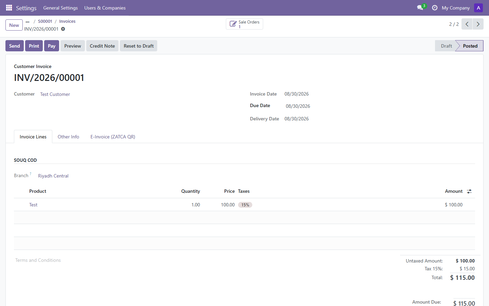

**E-Invoice (ZATCA QR)** — TLV payload rendered to a QR code on posting.
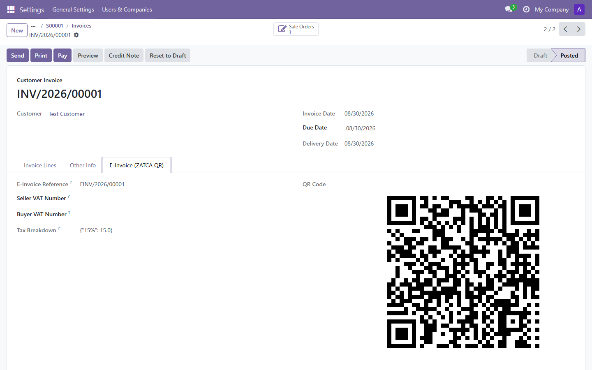

**COD collections** — expected vs. collected, settled state.
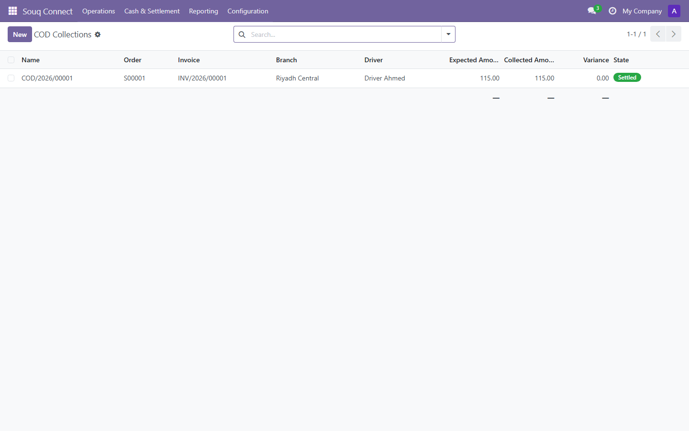

**Collection detail** — Pending → Collected → Settled, variance.
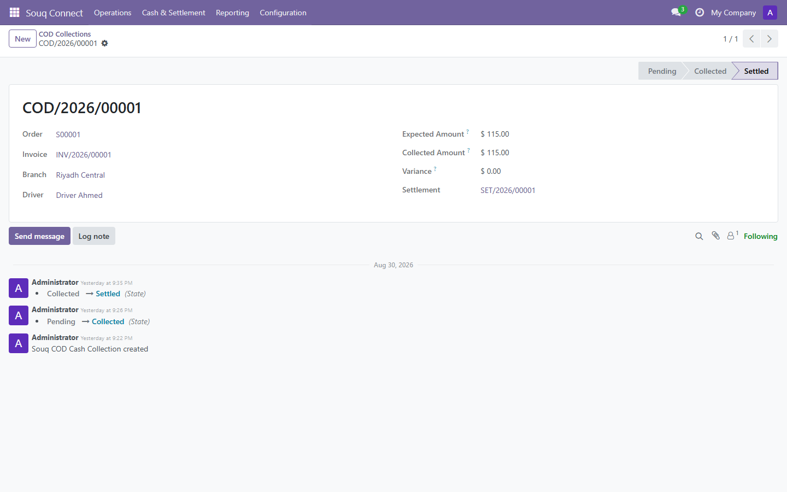

**Driver settlements** — total expected, handed in, variance.
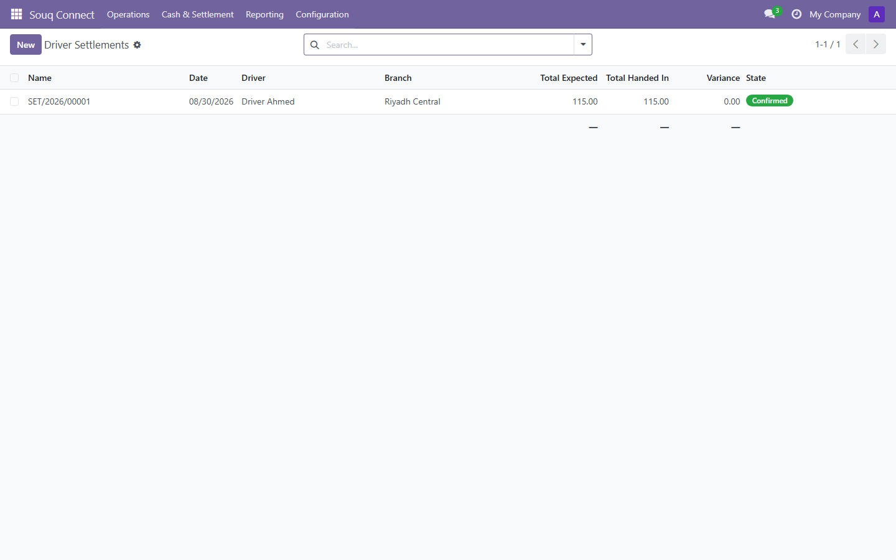

**Settlement detail** — confirmed, linked to its posted journal entry.
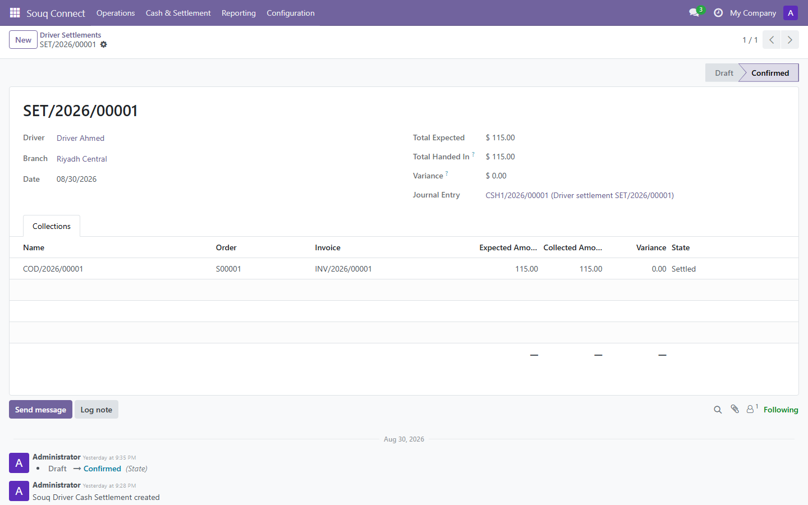

**User access rights** — the Souq Connect groups on the standard user form.
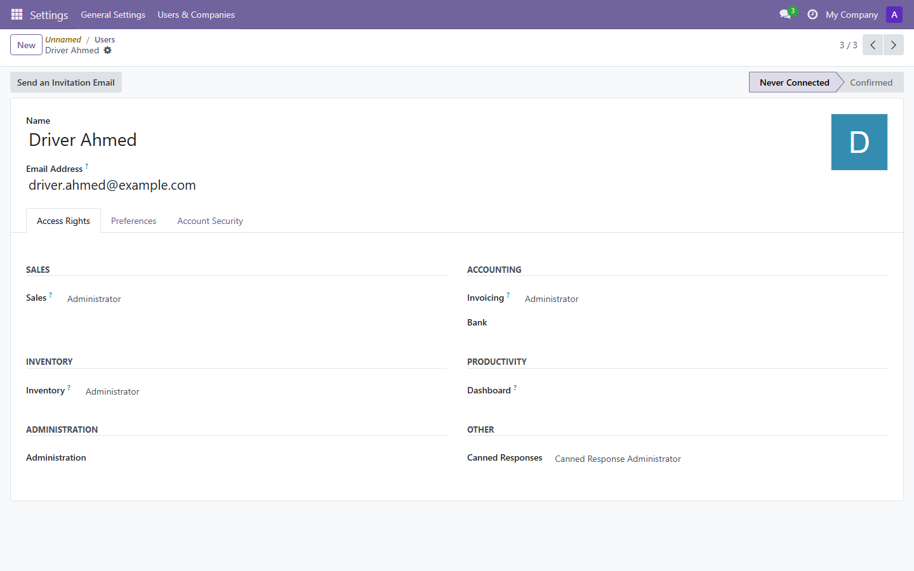

These are regenerated with one command against any running instance —
see [Screenshots](#screenshots) below.

## Install

### Locally
1. Copy/symlink this `souq/` directory into your Odoo 18 `addons_path`
   (so Odoo sees a module named `souq`).
2. `pip install qrcode` (optional — enables the e-invoice QR *image*;
   the TLV payload itself is always computed and stored).
3. Update Apps list, install **Souq Connect**.
4. Configuration > Branches: create at least one `souq.branch` with a
   warehouse and four accounts (cash, driver-clearing, cash-difference)
   plus a settlement journal.
5. Assign users to the **Souq Driver** / **Souq Cashier** / **Souq
   Accountant** / **Souq Manager** groups (Settings > Users).

### Docker (Odoo 18 + Postgres 16)
```bash
cd docker
docker compose up --build
```
Then open http://localhost:8069, create a database, and install
**Souq Connect**. The `souq` addon is mounted read-write from `../`
(this directory), so edits on the host are picked up on restart.

## The order-to-ledger flow

```
Sale order (payment_mode=cod, branch_id=X)
   -> action_confirm()                         [delivery created from branch warehouse]
   -> deliver: driver_id assigned, stock out    [stock.picking]
   -> invoice created & posted
        Dr Clearing Account   Cr Revenue + Tax  [account.move]
        (souq.cod.collection created, state=pending; driver copied
         over automatically if the delivery already had one)
   -> driver collects cash (full or partial)
        souq.cod.collection.action_collect()    [state=collected]
   -> driver settlement confirmed
        Dr Branch Cash         total_handed_in
        Cr Clearing Account    total_expected
        Dr/Cr Cash-Diff Acct   |variance|       [only if handed_in != expected]
        (collection + order -> settled)
```

A collection can only ever belong to one *confirmed* settlement —
attempting to settle it twice raises a `UserError`. An order can only
reach `settled` **through** a confirmed settlement, never directly
(`sale.order.set_cod_state('settled')` is gated on an internal context
flag that only `souq.driver.settlement.action_confirm()` sets).

### Return on delivery

If the customer refuses the parcel: **Refuse Delivery / Return** on the
picking (or the button on a `done` COD delivery) creates and validates a
return picking (stock reversed into the branch warehouse), cancels the
COD invoice (`button_cancel` — a cancelled move posts nothing, so there
is no residual clearing-account balance), and moves the collection/order
to `failed`.

## COD state machine

The lifecycle lives on `sale.order.cod_state`:
```
pending -> collected | failed
collected -> settled | failed
settled, failed: terminal
```
Illegal jumps (e.g. `pending -> settled`) raise a clear `UserError`.
Enforced identically on `souq.cod.collection.state`.

## Security

Four groups: **Souq Driver**, **Souq Cashier**, **Souq Accountant**,
**Souq Manager** (implies Cashier + Accountant). Record rules restrict
drivers to their own collections, settlements, cash floats and
deliveries. Only Manager/Accountant can confirm a driver settlement
(enforced both by the confirm button's `groups` and a server-side check
in `souq.driver.settlement.action_confirm`).

## E-invoicing (ZATCA-style QR)

On posting a customer invoice/credit note, `account.move` validates that
its tax lines reconcile with `amount_tax`, then builds a TLV
(tag-length-value) payload — seller name, seller VAT number, ISO-8601
timestamp, invoice total, VAT amount — base64-encodes it into
`qr_payload`, and (if the `qrcode` package is available) renders it to
`qr_image`. The **E-Invoice (ZATCA QR)** tab on the invoice form shows
both, plus `einvoice_reference` (from a dedicated shared sequence). The
bundled bilingual (Arabic/English), RTL QWeb report
(`souq_einvoice_document`) prints the QR alongside the invoice lines.

<details>
<summary><strong>SRS coverage</strong> (<code>Souq_Connect_SRS.docx</code>) and core methods overridden</summary>

All functional requirements from the SRS are implemented in this one
module (the SRS's 5-module architecture — souq_base / souq_cod /
souq_delivery / souq_einvoice / souq_branch_stock — is collapsed into a
single addon per the build decision made mid-project):

| FR | Implementation |
|---|---|
| FR-BASE-1/2 | `souq.branch`; `sale.order.branch_id` required for COD |
| FR-BASE-3 | Settings > Souq Connect: configurable COD surcharge policy |
| FR-BASE-4 | Sequences: `souq.cod.collection`, `souq.driver.settlement`, `souq.einvoice`, `souq.branch.transfer` |
| FR-BASE-5 | `ar.po` + RTL bilingual e-invoice QWeb report |
| FR-COD-1..5, 7 | `sale.order`/`souq.cod.collection` state machines, clearing-account posting, partial collection, return-on-delivery, settled-only-via-settlement guard |
| FR-COD-6 | `sale.order._souq_sync_cod_surcharge_line()` |
| FR-DEL-1..7 | `souq.driver.settlement`, `souq.driver.float`, `res.partner.souq_custody_balance`, double-settlement guard |
| FR-STK-1 | `sale.order` warehouse auto-sync + constraint against `branch_id.warehouse_id` |
| FR-STK-2/3 | `souq.branch.transfer` (draft → in_transit → done) |
| FR-STK-4 | `souq.branch.action_view_branch_stock()` / Stock by Branch report |
| FR-INV-1..4 | `models/souq_einvoice.py`: tax IDs, tax breakdown, TLV/QR, tax-reconciliation guard on post |

**Odoo core methods overridden:**

- `sale.order.create()` / `write()` — auto-fill `warehouse_id` from
  `branch_id` (FR-STK-1) and sync the COD surcharge line (FR-COD-6).
- `sale.order._create_invoices()` — redirect the COD receivable line to
  the branch clearing account.
- `account.move._post()` — overridden twice (COD collection creation +
  driver propagation; e-invoice tax-reconciliation guard + QR
  generation), chained via `super()`.
- `stock.picking.button_validate()` — propagate the assigned driver onto
  any matching COD collection.

</details>

## Tests

`tests/` (Odoo `TransactionCase`, see `tests/common.py` for shared
fixtures — one branch, three distinct accounts, a driver, a customer):

- `test_souq_branch.py` — branch creation, distinct-accounts constraint.
- `test_souq_cod.py` — COD invoice posts to the clearing account; a full
  settlement produces a balanced move; a partial collection routes its
  variance to the cash-difference account; double-settlement is
  rejected; illegal `cod_state` transitions are rejected.
- `test_souq_delivery.py` — driver assigned at delivery propagates onto
  the collection; return-on-delivery reverses stock, cancels the
  invoice, and leaves no residual clearing-account balance.
- `test_souq_einvoice.py` — TLV encode/decode round-trip; QR payload is
  generated and reconciles with the posted invoice's totals.
- `test_souq_srs_gaps.py` — COD surcharge (fixed + percentage), the
  settled-only-via-settlement guard (FR-COD-7), branch/warehouse sync
  and mismatch rejection (FR-STK-1), driver custody balance, and the
  inter-branch transfer draft → in_transit → done flow (FR-STK-2/3).

Run with:
```
odoo-bin -d <db> --test-enable --stop-after-init -i souq
```

## Screenshots

`screenshots/` holds the captured walkthrough shown at the top of this
README. To regenerate it against your own running instance:
```bash
pip install playwright
playwright install chromium
python scripts/take_screenshots.py \
    --url http://localhost:8069 \
    --db <your-database> \
    --login admin \
    --password admin \
    --out screenshots
```
Each step is best-effort — a step that needs a record which doesn't
exist yet (e.g. no COD order has been invoiced) is skipped with a
message instead of failing the whole run, so walk through the module
once by hand (or via a test) before running this if you want the full
set of 12 screenshots.
